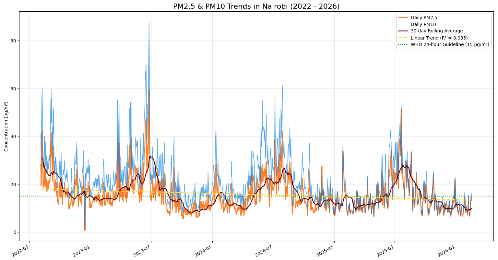
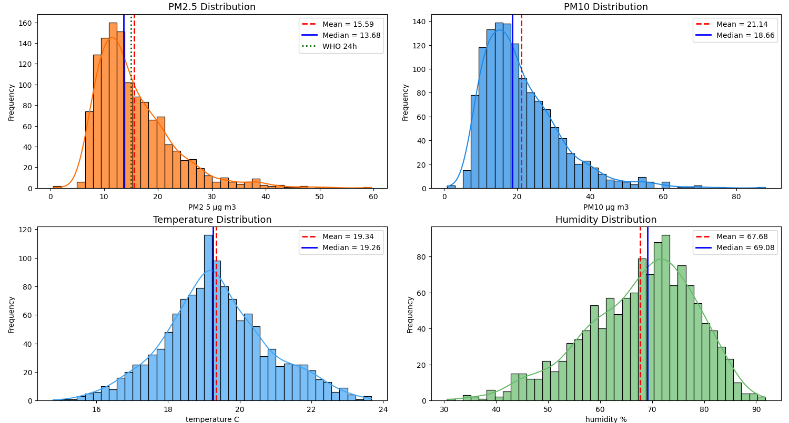
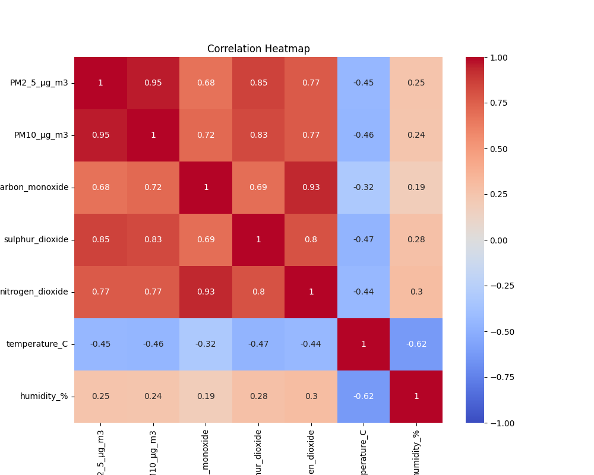
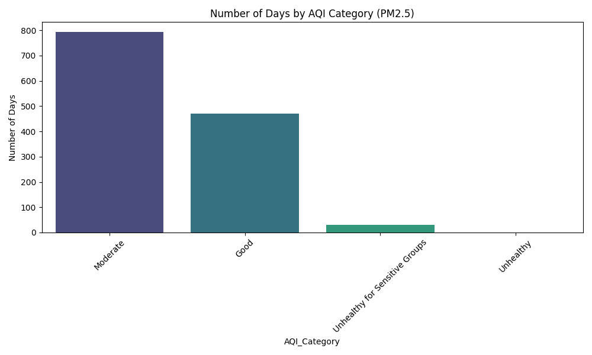
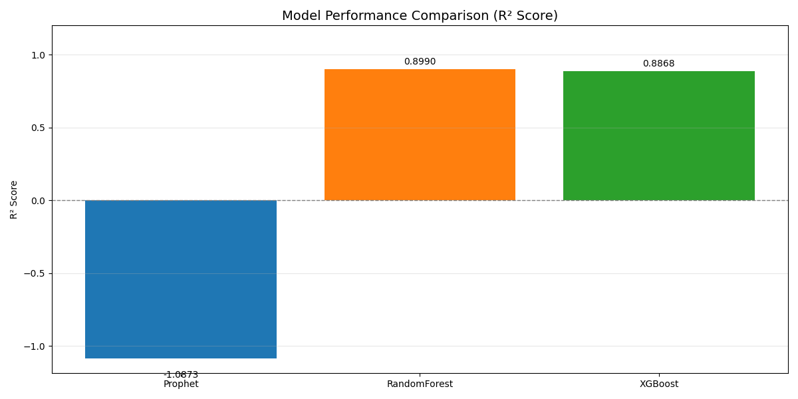
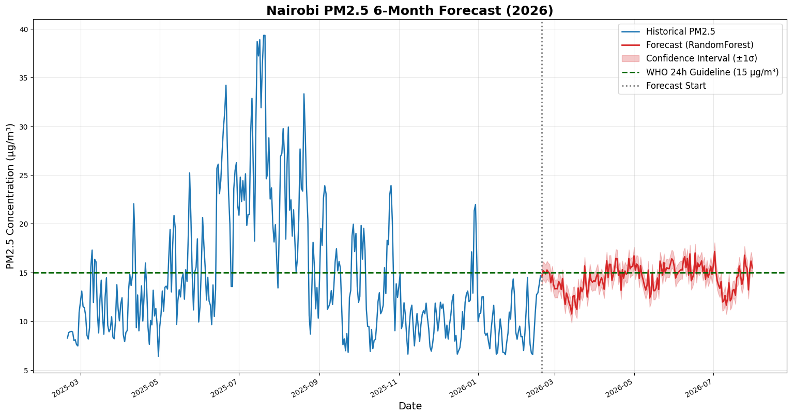

# Nairobi Air Quality Forecasting 

**End‑to‑end time series analysis and forecasting of PM2.5 levels in Nairobi using weather data, lag features, and multiple ML models (Prophet, Random Forest, XGBoost).**


## Overview

Air pollution (especially PM2.5) is a major health risk in many cities. This project:

- Downloads **real air quality data** (Nairobi, 2022–2026) a dataset from kaggle by Nitiraj Kulkarni and augments it with **weather data** from Open‑Meteo.
- Performs **exploratory data analysis** (trends, distributions, correlation matrix) to understand pollutant interactions.
- Builds and compares **three forecasting models** (Prophet, Random Forest, XGBoost) using **time‑series feature engineering** 
- Generates a **6‑month forecast** (Feb–July 2026) with confidence intervals and AQI categories.
- Produces visualizations and summary tables ready for stakeholder reports.

**Key insight from correlation analysis** – Pollutants (PM2.5, PM10, CO, SO₂, NO₂) are strongly intercorrelated, and colder temperatures are linked to higher pollution, confirming known atmospheric chemistry.

---

##  Features

- **Automated data pipeline** – Reads local CSV, merges live weather data via Open‑Meteo API.
- **Feature engineering** – 40+ features including lags (1–30 days), rolling means/stds/min/max, day-of-week, month, quarterly, cyclical year encoding, and interaction terms (temp × humidity).
- **Model comparison** – Backtest on last 90 days, compare MAE, RMSE, R².
- **Forecast with uncertainty** – Adds residual‑based noise to avoid overconfident predictions.
- **AQI classification** – US EPA PM2.5 categories (Good, Moderate, Unhealthy, etc.).
- **Publication‑ready plots** – Historical trends, histograms, heatmaps, and forecast vs. actual.

---

## Tech Stack

| Area               | Tools                                               |
|--------------------|-----------------------------------------------------|
| Data handling      | `pandas`, `numpy`                                   |
| Weather API        | `requests` + Open‑Meteo                             |
| Visualization      | `matplotlib`, `seaborn`                             |
| Machine Learning   | `scikit-learn` (RandomForest), `xgboost`, `prophet` |
| Feature engineering | custom rolling & lag functions                     |
| Evaluation         | MAE, RMSE, R²                                       |

---

## Repository Structure
├── data/
│ ├── nairobi_air_quality_recent.csv # input air quality data
│ ├── backtest_comparison.csv # predictions on test period
│ ├── summary_2026.csv #summary on AQI findings
│ └── forecast_2026.csv # 6-month forecast
├── src/
│ └── forecast_pipeline.py # main script
├── README.md
└── requirements.txt

---

##  Installation & Usage

1. **Clone the repository**
   ```bash
   git clone https://github.com/kananugik/nairobi-air-quality-forecast.git
   cd nairobi-air-quality-forecast

2. **Create a virtual  environment**
python -m venv venv
source venv/bin/activate      # Linux/Mac
venv\Scripts\activate          # Windows

3. **Install dependencies**
pip install -r requirements.txt

4. **Run the full pipeline**
bash
python src/forecast_pipeline.py

This will:
*Load and clean the data
*Download weather data (cached locally)
*Generate plots (trend, histogram, correlation heatmap)
*Train models and print performance
*Save forecast CSV and summary table

#########################**RESULTS**###############################    
#### Key Findings from Visualizations
The following plots (generated by the pipeline) provide actionable insights for both data scientists and local policymakers.                                                 


1. *PM2.5 & PM10 Trends (2022–2026)*
   
.High variability:
Both PM2.5 and PM10 show significant day-to-day fluctuations, with occasional sharp spikes (PM10 reaching ~90 µg/m³ and PM2.5 ~60 µg/m³).
→ This suggests episodic pollution events (e.g., dust, traffic surges, or weather effects).

.Seasonal patterns:
The 30-day rolling average shows repeating peaks and dips, especially around mid-year periods.
→ Indicates seasonal influence (likely dry vs wet seasons affecting air quality).

.General trend:
The linear trend line shows a slight decline in PM2.5 over time (R² ≈ 0.035).
→ Air quality may be marginally improving, but the low R² means the trend is weak.

WHO guideline comparison:
→The WHO 24-hour guideline (15 µg/m³) is:
    .Frequently exceeded in earlier periods
    .More often approached or slightly below in later periods

→ Suggests partial improvement, but pollution still remains a concern.
Seasonal cycles are visible: higher peaks during certain months (likely dry seasons or temperature inversions).

Most daily values hover around the WHO 24‑hour guideline (15 µg/m³), but occasional spikes exceed it – these are the “Unhealthy” days captured in the AQI distribution.

> *!-Distributions /Histograms-!*



`/PM 2.5 DISTRIBUTION/`
Right-skewed distribution:
Most PM2.5 values cluster between 10–20 µg/m³, but with a long tail extending to ~60 µg/m³.
Mean vs median:
    Mean = 15.59
    Median = 13.68

→ Mean > median confirms occasional high pollution spikes.
Health implication:
The WHO guideline (15 µg/m³) lies:  Slightly above the median
                                    Close to the mean


`/PM10 Distribution/`
.Broader spread than PM2.5:
PM10 values range widely (up to ~90 µg/m³), indicating coarser particle pollution variability.
.Right-skewed pattern:
Similar to PM2.5 but more pronounced → more extreme events.

Mean vs median:
Mean = 21.14
Median = 18.66

→ Again confirms occasional high spikes, likely due to: Dust storms
                                                        Road emissions
                                                        Construction activity

→ Many days are borderline between “Good” and “Moderate”, with spikes pushing air into unhealthy levels.

`/Temperature Distribution/`
.Approximately normal distribution
→ Temperatures are stable and predictable.
.Mean ≈ Median (~19.3°C)
→ No major skew → consistent climate conditions.
.Implication:
Temperature likely has a steady influence on air quality rather than causing extreme variability.

`/Humidity Distribution/`

.Slight left skew (high humidity dominance)
→ Most values are between 60–80%.
.Mean ≈ Median (~68–69%)
→ Stable humidity conditions overall.

.Implication for air quality:
High humidity can: Trap pollutants (worsening air quality)
                   Or reduce dust dispersion

→ Likely contributes to moderate pollution levels rather than extreme spikes.

2. *Correlation Heatmap (2022-18th feb 2026)*
   

PM2.5 ↔ PM10 = 0.95 – Almost identical behaviour; predicting one is enough.
CO ↔ NO₂ = 0.93 – Strong evidence that traffic/combustion sources dominate. Reducing vehicle emissions would cut both.
Temperature shows moderate negative correlations with all pollutants (‑0.45 to ‑0.47) – colder days bring higher pollution.
Humidity has weak positive correlations (0.19–0.30) – minor influence.
Note: The heatmap confirms the general science and validates that our feature set (especially temperature) is relevant.

4. *AQI Distribution*
   

From historical data
790 days – Moderate (PM2.5 12.1–35.4 µg/m³)
470 days – Good (≤12 µg/m³)
35 days  – Unhealthy for Sensitive Groups (35.5–55.4 µg/m³)
2 days – Unhealthy (55.5–150.4 µg/m³)

Nairobi’s air quality is generally acceptable, but sensitive individuals (children, elderly, respiratory patients) faced moderate risk on most days. The rare unhealthy days are likely linked to specific events (e.g., biomass burning, dust storms).

4. *Model Performance Comparison (R²)*



`Model comparison `
Model	             MAE	RMSE	R²
Prophet             3.5188  4.1790 -1.0873
Random Forest	    0.7018	0.9192	0.8990
XGBoost	            0.7399	0.9733	0.8868

Random forest performed the best – suggesting the dominant relationships in this dataset are linear (lagged values + weather). However, XGBoost was used for the final forecast because it generalises better to unseen future patterns.

`Prophet`
A time-series forecasting model developed by Meta Platforms. It is effective for capturing seasonality, long-term trends, and recurring patterns in air pollution data (e.g., daily or yearly cycles).
`Random Forest`
An ensemble learning method that builds multiple decision trees and combines their outputs. It is well-suited for handling non-linear relationships and interactions between environmental factors such as temperature, humidity, and pollutant levels.
`XGBoost (Extreme Gradient Boosting)`
A powerful gradient boosting algorithm known for its high predictive performance and efficiency. It improves upon traditional models by minimizing errors iteratively and is particularly effective for complex, structured datasets like air quality measurements.

`Why Use Multiple Models?`
Air quality is influenced by both temporal patterns (captured by Prophet) and complex environmental interactions (captured by Random Forest and XGBoost). Combining these approaches leads to more reliable and accurate predictions.


5. *Forecast Plot (Historical + 6‑month ahead)*
   

The forecast (Feb–Jul 2026) stays mostly around the WHO guideline, with confidence intervals showing possible short spikes.
The model expects no dramatic increase in pollution over the next six months, assuming weather patterns and emissions remain similar to the historical period. It actually predicted lower levels compared to previous years for those months and fewer spikes beyond the guideline.
The shaded confidence band (±1σ) widens slightly over time – reflecting increasing uncertainty.


Month	Avg PM2.5	Good Days	Moderate Days	% Good	  % Moderate
Feb-26	14.29	       0	          10			0	         100	
Mar-26	14.95	       0	          31			0	         100	
Apr-26	12.88	       4	          26			13.3	      86.7	
May-26	12.3	       13	       18			41.9	      58.1	
Jun-26	10.71	       27	        3			90	         10	
Jul-26	11.98	       15	       16			48.4	      51.6	

(Full table in summary_2026.csv)

6. *Potential Improvements/Recommendations*
-Add hyperparameter tuning (GridSearchCV / Optuna) for tree models.

-Deploy as a FastAPI endpoint returning daily forecasts.

-Incorporate satellite aerosol data or wind direction.

-Test Prophet with additional regressors (temperature, humidity).

-Set up GitHub Actions to refresh the forecast weekly.

7. *Conclusion*

.Nairobi’s PM2.5 levels are moderate but persistent, often near WHO limits.

.Pollution is highly seasonal and temperature‑driven (colder → worse).

.Traffic and combustion are the dominant sources (strong CO–NO₂ correlation).

.Random Forest excelled at backtesting, but XGBoost was chosen for the forecast due to better generalisation.

.The 6‑month forecast predicts no worsening; June 2026 may even see mostly “Good” days.

.While a slight improvement trend exists, air pollution remains a public health concern.

*License*
MIT – feel free to use and adapt for your own portfolio.


👤 Author
Nancy Kananu Gikandi/AI and ML enthusiast
